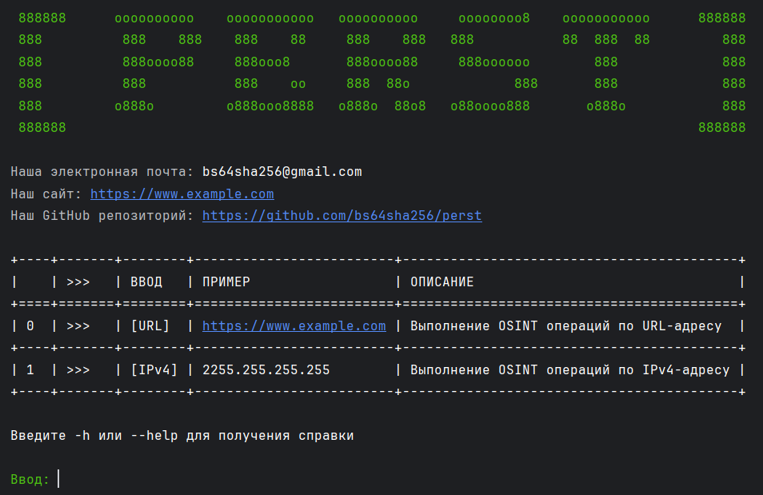

# PERST OSINT PROJECT

<figure><figcaption></figcaption></figure>

## Приветствие

**Здравствуйте**

> Этот инструмент предназначен для OSINT-разведки и сканирования WEB-ресурсов и IPv4-адресов. Надеемся он будет вам полезен

## Установка

**Клонировать репозиторий**

```bash
git clone https://github.com/bs64sha256/perst
cd perst
```

**Установка завизимостей**

```bash
pip install -r requirements.txt
```

**Установка Исполняемого файла**

скачайте и распакуйте папку dist/main и дважды кликните по файлю .exe левой кнопкой мыши

> Файл может открываться и сразу-же закрываться, мы не знаем с чем это связано, но постараемся это исправить. В таком случае рекомендуем вам возпользоваться клонированием репозитория

## Использование

```bash
python main.py
```
или
```bash
py main.py
```
> Необходима предварительная установка интерпретатора языка программирования Python
